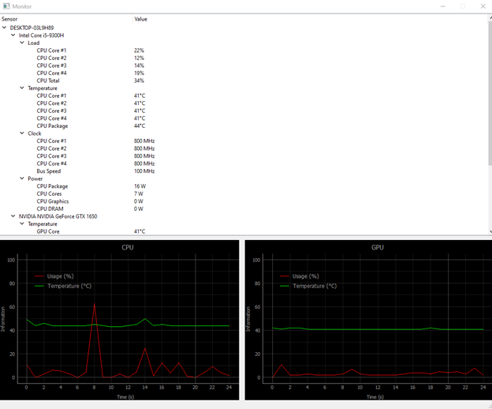

# Monitoring sensor information on the CPU and GPU

## About project 
This application represents an application with graphic interface that shows main information about CPU, GPU, such as frequency, temperature, battery charging percentage and power consumption. Besides that, if the device it is running on offers access to the information about the rotation speed of the fans, it would also display this, but the motherboard of my device and the BIOS do not offer direct access to such information, so no software licensee cannot extract it.

**Main window**

**CPU information**

**GPU information**

**The information about the CPU and GPU represented on the graph (Usage and Temperature depending on time)**

### Dependencies and installation
- Python3
- pythonnet -- ``pip install -- pre pythonnet``
- PyQt5
- PyQtGraph -- ``pip install pyqtgraph``

**The application used in creating the UI:** Qt Designer

**Pentru a porni aplicatia sunt nevoie de drepturi de administrator, in caz contrar aplicatia nu va putea extrage informatia de pe anumiti sensori.**